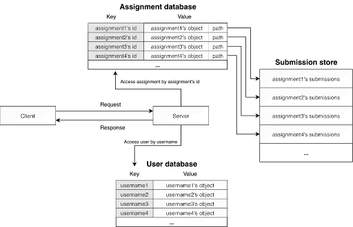
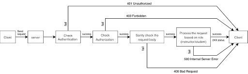
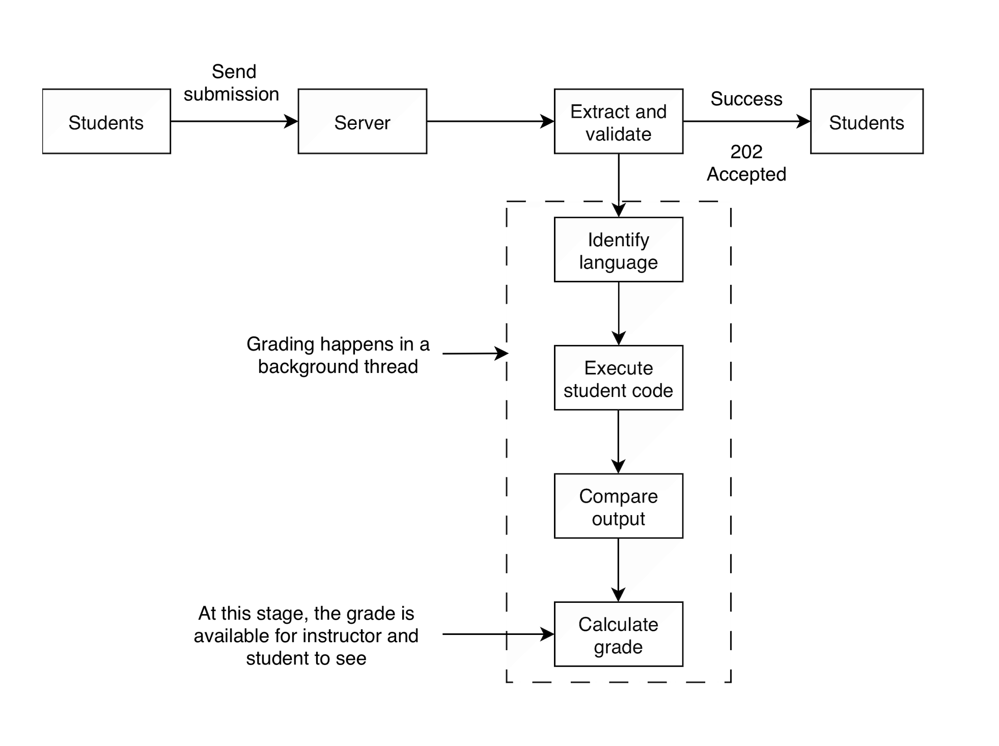

# Coding Assignment Management System (CAMS)
CAMS is a high-concurrency grading engine built in Go that automates the entire lifecycle of a coding assignment, from initial submission to final gradebook generation. While traditional Learning Management Systems are generalized to accommodate every faculty, CAMS is built exclusively for coding assignment, allowing it to optimize the user experience through secure, multi-language execution, and instant automated feedback.
## Why CAMS over traditional Learning Management System (LMS)
In a traditional LMS, the instructor has to create an assignment, host it in the LMS, wait for the students to submit their assignments, download all the students' submissions, and then has to write a script to run the submissions and finally put it into the gradebook. While these do not sound like a lot of work, the time it takes adds up over time. These repetitive tasks can simply be automated by hosting coding assignments on CAMS. When an instructor hosts an assignment in CAMS, they only need to specify the allowed languages, provide the test cases and expected output; when the students submit their assignment, CAMS runs the student’s submission with the provided input and compares that to the expected output; after the due time, the instructor only needs to download the gradebook and they are done with the grading.
## Features
- **Automated Grading**: Automatically runs student submissions against instructor-provided test cases and calculates grades.
- **Multi-Language Support**: Supports Python (.py), C (.c), C++ (.cpp), Java (.java), and Golang (.go).
- **Role-Based Access**: Hides test cases and other students' grades on the server side.
- **Secure Execution**: Limits execution to 5 seconds per submission to discourage inefficient implementations.
## Architecture
### Design Overview

### Request Pipeline

### Submission lifecycle

## Getting Started
### Prerequisites
- A modern computer with curl installed.
- Supported language runtimes (Python, C, C++, Java, Go) must be installed on the server.
